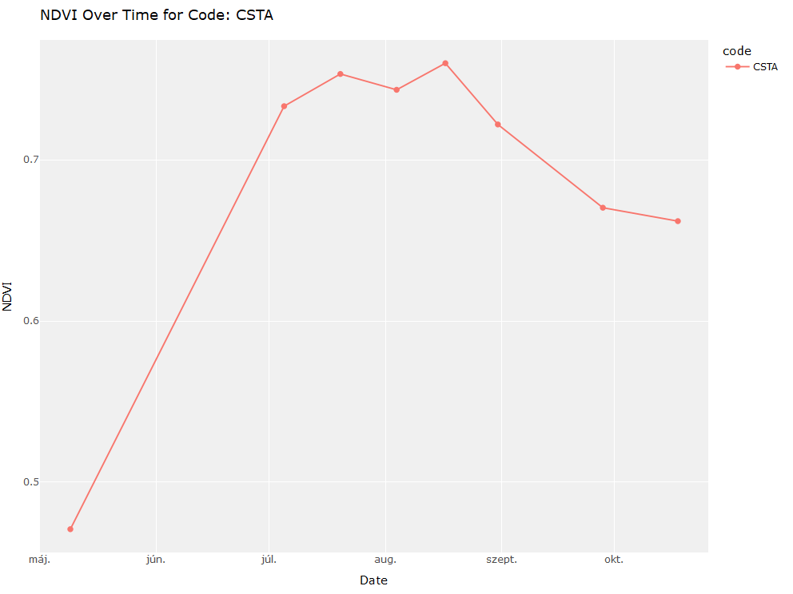

 <!-- README.md is generated from README.Rmd. Please edit that file -->

```{r, include = FALSE}
knitr::opts_chunk$set(
  collapse = TRUE,
  comment = "#>",
  fig.path = "man/figures/",
  out.width = "100%"
)
options(tibble.print_min = 5, tibble.print_max = 5)
```

# VegetationAnalysisToolkit </a>

<!-- badges: start -->
[](https://cran.r-project.org/package=VegetationAnalysisToolkit)
[](https://github.com/VegetationAnalysisToolkit/actions/workflows/R-CMD-check.yaml)
[](https://app.codecov.io/gh/VegetationAnalysisToolkit?branch=main)
<!-- badges: end -->


## Overview

 VegetationAnalysisToolkit package is designed to provide a unified software platform for soil scientists and researchers, facilitating the efficient management and processing of field measurement data. The toolkit currently supports two key vegetation indices: the Normalized Difference Vegetation Index (NDVI) and the Chlorophyll Content Index (CCI), streamlining the handling of raw data from compatible instruments:

* MC-100 Chlorophyll Concentration Meter (Apogee Instruments)
* PlantPen NDVI & PRI (Photon Systems Instruments).

The package offers a suite of functions designed to streamline the analysis and visualization of these indices within an intuitive and user-friendly environment:

* `process_PlantPen_NDVI_PRI()` processes PlantPen NDVI & PRI data.
* `process_MC100_Chlorophyll()` processes MC-100 Chlorophyll Concentration Meter data.
* `plot_measurement_data()` generates visualizations.
* `generate_statistics()` computes statistics.

If you are new to VegetationAnalysisToolkit, the best place to start after installing the package is trying to reproduce the example listed here in the [Getting started section](#getting-started) or to check out the detailed [Documentation](#documentation) of the package.

## Installation

```{r, eval = FALSE, message = FALSE}
# If devtools is not installed, install it first:
install.packages("devtools")

# Install VegetationAnalysisToolkit from GitHub
install_github("anonymus06/VegetationAnalysisToolkit")

# Alternatively, install from CRAN
install.packages("VegetationAnalysisToolkit", repos = "https://cloud.r-project.org")
```

### Development version

To get a bug fix or to use a feature from the development version, you can install
the development version of VegetationAnalysisToolkit from GitHub.

```{r, eval = FALSE, message = FALSE}
# install.packages("pak")
pak::pak("anonymus06/VegetationAnalysisToolkit")
```

## Getting started

The following example demonstrates how to process NDVI data measured by the PlantPen NDVI & PRI instrument. To get a local copy up and running follow these simple example steps!

First, set up your output folder and use the sample data provided within the package folder by locating it using the `system.file()` function.

```{r, eval = FALSE, message = FALSE}
folder_path <- system.file("extdata", "plantpen_ndvi_pri_data", package = "VegetationAnalysisToolkit")
output_path <- "your/path/to/save/your/data"
```

```{r, echo = FALSE, message = FALSE, results = 'hide'}
# Set up temporary directories for the data
temp_input <- file.path(tempdir(), "temp_input", "/")
temp_output <- file.path(tempdir(), "temp_output", "/")

if (!dir.exists(temp_input)) {
 dir.create(temp_input, recursive = TRUE)
 }
if (!dir.exists(temp_output)) {
 dir.create(temp_output, recursive = TRUE)
 }

source_path <- system.file("extdata", "plantpen_ndvi_pri_data", package = "VegetationAnalysisToolkit")
config_path <- system.file("extdata", "config.txt", package = "VegetationAnalysisToolkit")
file.copy(source_path, temp_input, recursive = TRUE)
file.copy(config_path, temp_input)
folder_path <- file.path(temp_input, "plantpen_ndvi_pri_data")
output_path <- temp_output
```

Next, use the `process_PlantPen_NDVI_PRI()` function to load and process the NDVI data:

```{r, message = FALSE}
# Load package
library(VegetationAnalysisToolkit)
```

```{r, message = FALSE}
# Process the NDVI data
process_PlantPen_NDVI_PRI(
 folder_path, 
 output_path,
 lower_limit = 0.0,
 upper_limit = 1.0,
 variable = "NDVI",
 validate = TRUE,
 split_code = TRUE
 )
```

The processed data is stored in an Excel file. Below is a preview of the content:

```{r, echo = FALSE, message=FALSE}
library(openxlsx)

filename <- "NDVI_filtered.xlsx"
output_file <- file.path(paste0(output_path, filename))
output_data <- read.xlsx(output_file, startRow = 8)
output_data$Date <- as.Date(output_data$Date, origin = "1899-12-30")

print(head(output_data, n = 10))
```

During the data processing, a feedback file is generated. This file summarizes the data filtering results, detailing which data points were excluded. Reviewing this feedback can help ensure the quality of your data analysis.

Below is an excerpt from the generated _ndvi_feedback.txt_ file:

```{r, echo = FALSE, message = FALSE}
feedback_file <- file.path(paste0(output_path, "NDVI_feedback.txt"))
feedback_content <- readLines(feedback_file)
feedback_content <- feedback_content[8:length(feedback_content)]

cat(head(feedback_content, n = 10), sep = "\n")
```

In addition, a validation report can be generated. This report helps to identify any potential issues with the dataset. Below is an excerpt from the _val_issues.txt_ file, showing an example of the types of errors and warnings that could be encountered.

```{r, echo = FALSE, message = FALSE}
validation_file <- file.path("val_issues.txt")
validation_content <- readLines(validation_file)

cat(head(validation_content, n = 3), sep = "\n")
```


The next step involves generating statistics using `generate_statistics()` from the processed data:

```{r, message = FALSE}
generate_statistics(output_path)
```

```{r, echo = FALSE, message=FALSE}
output_file <- file.path(output_path, "NDVI_statistics_output.txt")
output_content <- readLines(output_file)
output_content <- output_content[8:length(output_content)]

cat(head(output_content, n = 10), sep = "\n")
```


Finally, the processed data is visualized with `plot_measurement_data()` for easier interpretation. The plot below shows the NDVI data over time for the specified site:

```{r, eval = FALSE}

# Plot NDVI data as a time series
plot_measurement_data(output_path,
                      variable = "NDVI",
                      code = "CSTA",
                      tstart = "2023-07-10",
                      tend = "2023-10-18",
                      plot_type = "time_series")
```

```{r plot-example, include = FALSE}
# Technical code to generate the static plot, not shown in README #

library(webshot)
library(htmlwidgets)
library(plotly)

# Your plotly plot
p <- plot_measurement_data(output_path,
                      variable = "NDVI",
                      code = "CSTA",
                      tstart = "2023-07-10",
                      tend = "2023-10-18",
                      plot_type = "time_series")

# Modify the existing plot object p
p <- p %>%
  layout(
    paper_bgcolor = "white", # Set the background color of the entire plot to gray
    plot_bgcolor = "#f0f0f0", # Set the background color of the plotting area to gray
    xaxis = list(
      showgrid = TRUE, # Show grid lines
      gridcolor = "white", # Set grid line color to white
      zerolinecolor = "white", # Set zero line color to white
      linecolor = "white", # Set the axis line color to white
      tickcolor = "white", # Set the tick color to white
      title = list(standoff = 15),
      titlefont = list(color = "white") # Set the axis title color to white
    ),
    yaxis = list(
      showgrid = TRUE, # Show grid lines
      gridcolor = "white", # Set grid line color to white
      zerolinecolor = "white", # Set zero line color to white
      linecolor = "white", # Set the axis line color to white
      tickcolor = "white", # Set the tick color to white
      titlefont = list(color = "white") # Set the axis title color to white
    ),
    font = list(color = "white"), # Set the color of text elements
    margin = list(l = 50, r = 50, t = 50, b = 50) # Set plot margins
  )

# Save the plot as an HTML file
htmlwidgets::saveWidget(p, "man/figures/plantPen_ndvi_output.html")

# Convert the HTML file to a PNG image
webshot::webshot("man/figures/plantPen_ndvi_output.html", file = "man/figures/plantPen_ndvi_output.png")

# Delete junk files
unlink("man/figures/plantPen_ndvi_output.html")
unlink("man/figures/plantPen_ndvi_output_files", recursive = TRUE)
```

```{r, echo = FALSE, message=FALSE}
# Technical code to generate the static plot, not shown in README #


# Delete junk png file
unlink("man/figures/plot-example-1.png")
```


## Documentation

For detailed instructions on how to use the VegetationAnalysisToolkit, check out the package [vignettes](https://github.com/anonymus06/VegetationAnalysisToolkit/tree/master/vignettes) or refer to the official documentation.

A **cheat sheet** will be available soon to summarize the key functions and workflows for easy reference.

## Getting help

If you encounter a clear bug, please file an issue with a minimal reproducible example on [GitHub](https://github.com/anonymus06/VegetationAnalysisToolkit/issues). For questions or further inquiries, feel free to reach out to me directly via [email](levente.czelnai@gmail.com).

## License

This project is licensed under the MIT License - see the [LICENSE.md](LICENSE.md) file for details.
