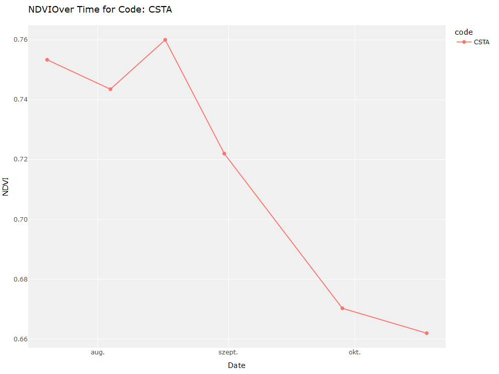

<!-- README.md is generated from README.Rmd. Please edit that file -->

# VegetationAnalysisToolkit </a>

<!-- badges: start -->

[](https://cran.r-project.org/package=VegetationAnalysisToolkit)
[](https://github.com/VegetationAnalysisToolkit/actions/workflows/R-CMD-check.yaml)
[](https://app.codecov.io/gh/VegetationAnalysisToolkit?branch=main)
<!-- badges: end -->

## Overview

VegetationAnalysisToolkit package is designed to provide a unified
software platform for soil scientists and researchers, facilitating the
efficient management and processing of field measurement data. The
toolkit currently supports two key vegetation indices: the Normalized
Difference Vegetation Index (NDVI) and the Chlorophyll Content Index
(CCI), streamlining the handling of raw data from compatible
instruments:

- MC-100 Chlorophyll Concentration Meter (Apogee Instruments)
- PlantPen NDVI & PRI (Photon Systems Instruments).

The package offers a suite of functions designed to streamline the
analysis and visualization of these indices within an intuitive and
user-friendly environment:

- `process_PlantPen_NDVI_PRI()` processes PlantPen NDVI & PRI data.
- `process_MC100_Chlorophyll()` processes MC-100 Chlorophyll
  Concentration Meter data.
- `plot_measurement_data()` generates visualizations.
- `generate_statistics()` computes statistics.

If you are new to VegetationAnalysisToolkit, the best place to start
after installing the package is trying to reproduce the example listed
here in the [Getting started section](#getting-started) or to check out
the detailed [Documentation](#documentation) of the package.

## Installation

``` r
# If devtools is not installed, install it first:
install.packages("devtools")

# Install VegetationAnalysisToolkit from GitHub
install_github("anonymus06/VegetationAnalysisToolkit")

# Alternatively, install from CRAN
install.packages("VegetationAnalysisToolkit", repos = "https://cloud.r-project.org")
```

### Development version

To get a bug fix or to use a feature from the development version, you
can install the development version of VegetationAnalysisToolkit from
GitHub.

``` r
# install.packages("pak")
pak::pak("anonymus06/VegetationAnalysisToolkit")
```

## Getting started

The following example demonstrates how to process NDVI data measured by
the PlantPen NDVI & PRI instrument. To get a local copy up and running
follow these simple example steps!

First, set up your output folder and use the sample data provided within
the package folder by locating it using the `system.file()` function.

``` r
folder_path <- system.file("extdata", "plantpen_ndvi_pri_data", package = "VegetationAnalysisToolkit")
output_path <- "your/path/to/save/your/data"
```

Next, use the `process_PlantPen_NDVI_PRI()` function to load and process
the NDVI data:

``` r
# Load package
library(VegetationAnalysisToolkit)
```

``` r
# Process the NDVI data
process_PlantPen_NDVI_PRI(
 folder_path, 
 output_path,
 lower_limit = 0.0,
 upper_limit = 1.0,
 variable = "NDVI",
 validate = TRUE,
 split_code = TRUE
 )
#> ===== Configuration =====
#> Device: PlantPen NDVI & PRI
#> Selected variable: NDVI
#> Lower limit: 0
#> Upper limit: 1
#> Split Code Columns: ON
#> Data validation: ON
#> =========================
#> ===== Activity Log =====
#>  * Validation completed without any known issues. Note: Not all potential issues are checked. 
#>  * Invalid code detected: GERGELY1, GERGELY2, GERGELY3 
#>  * Invalid code detected: CSRHP, CSUHP, SZCS, SZU 
#>  * Invalid code detected: T1 , T1, TS1 , TS1, Cc1, T2_new , Ts4_A, T1_A, Cc1_A, T2_new_A, TS1_A 
#>  * Invalid code detected: SZCS, SZU 
#>  * Invalid code detected: SZCS, SZ2, SZ3, SZ4, SZU 
#>  * Data filtering results are available in 'NDVI_feedback.txt' (summary) and 'NDVI_detailed_feedback.txt' (detailed). 
#>  * Data (filtered and raw) saved to: C:\Users\Levente\AppData\Local\Temp\Rtmpqkqk0H/temp_output/ 
#>  * In filtered data, values outside of bounds: 0 and 1 [NDVI] were discarded! 
#> =========================
```

The processed data is stored in an Excel file. Below is a preview of the
content:

    #>          Date Code Position Landuse InterRow NDVI
    #> 1  2023-10-18 CSTF        F     CST        S 0.62
    #> 2  2023-10-18 CSTF        F     CST        S 0.59
    #> 3  2023-10-18 CSTF        F     CST        S 0.58
    #> 4  2023-10-18 CSTF        F     CST        S 0.50
    #> 5  2023-10-18 CSTF        F     CST        S 0.60
    #> 6  2023-10-18 CSTF        F     CST        S 0.61
    #> 7  2023-10-18 CSTF        F     CST        S 0.62
    #> 8  2023-10-18 CSTF        F     CST        S 0.59
    #> 9  2023-10-18 CSTF        F     CST        S 0.56
    #> 10 2023-10-18 CSTF        F     CST        S 0.55

During the data processing, a feedback file is generated. This file
summarizes the data filtering results, detailing which data points were
excluded. Reviewing this feedback can help ensure the quality of your
data analysis.

Below is an excerpt from the generated *ndvi_feedback.txt* file:

    #> Summary of Data Filtering, Grouped by Code:
    #> Code       Total   Filtered  Removed Percentage Removed (%)
    #> ----       -----   --------  ------- ---------------------
    #> CSRA       161     161       0       0.00                
    #> CSRAHP     81      80        1       1.23                
    #> CSRAHPSK   80      80        0       0.00                
    #> CSRASK     89      86        3       3.37                
    #> CSRF       165     158       7       4.24                
    #> CSRFSK     90      90        0       0.00                
    #> CSRHP      20      20        0       0.00

In addition, a validation report can be generated. This report helps to
identify any potential issues with the dataset. Below is an excerpt from
the *val_issues.txt* file, showing an example of the types of errors and
warnings that could be encountered.

    #> 2024-07-01 13:35:25 - Non-sequential values detected in column 'index', dataset: 'plantpen_NDVI_231018.txt' . Source file: 'inst/extdata/ndvi/plantpen_NDVI_231018.txt'
    #> 2024-07-01 14:21:15 - Duplicate rows found in the data. Source file: 'inst/extdata/ndvi/plantpen_NDVI_231018.txt'
    #> 2024-07-01 15:00:03 - The data frame 'plantpen_NDVI_231018.txt' is empty. Source file: 'inst/extdata/ndvi/plantpen_NDVI_231018.txt'

The next step involves generating statistics using
`generate_statistics()` from the processed data:

``` r
generate_statistics(output_path)
```

    #> Code       Mean_NDVI  SD_NDVI    Min_NDVI   Max_NDVI   N    
    #> ----       ---------  -------    -------    -------    -    
    #> CSRA       0.706      0.093      0.410      0.820      161  
    #> CSRAHP     0.664      0.078      0.290      0.780      80   
    #> CSRAHPSK   0.569      0.159      0.010      0.780      80   
    #> CSRASK     0.616      0.116      0.120      0.730      86   
    #> CSRF       0.646      0.098      0.420      0.790      158  
    #> CSRFSK     0.628      0.140      0.010      0.800      90   
    #> CSRHP      0.689      0.056      0.490      0.770      20   
    #> CSTA       0.690      0.087      0.310      0.800      177

Finally, the processed data is visualized with `plot_measurement_data()`
for easier interpretation. The plot below shows the NDVI data over time
for the specified site:

``` r

# Plot NDVI data as a time series
plot_measurement_data(output_path,
                      variable = "NDVI",
                      code = "CSTA",
                      tstart = "2023-07-10",
                      tend = "2023-10-18",
                      plot_type = "time_series")
```



## Documentation

For detailed instructions on how to use the VegetationAnalysisToolkit,
check out the package
[vignettes](https://github.com/anonymus06/VegetationAnalysisToolkit/tree/master/vignettes)
or refer to the official documentation.

A **cheat sheet** will be available soon to summarize the key functions
and workflows for easy reference.

## Getting help

If you encounter a clear bug, please file an issue with a minimal
reproducible example on
[GitHub](https://github.com/anonymus06/VegetationAnalysisToolkit/issues).
For questions or further inquiries, feel free to reach out to me
directly via [email](levente.czelnai@gmail.com).

## License

This project is licensed under the MIT License - see the
[LICENSE.md](LICENSE.md) file for details.
